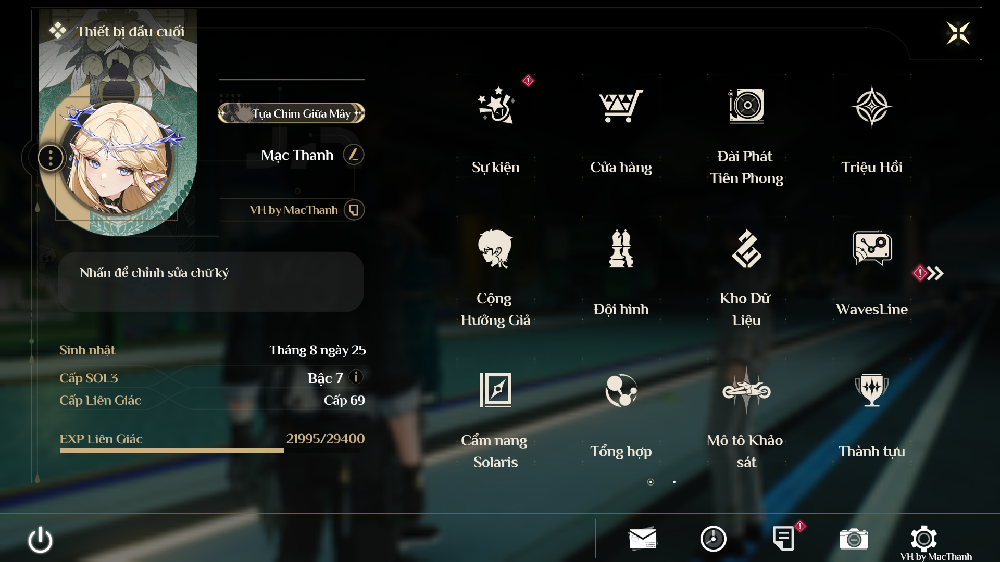
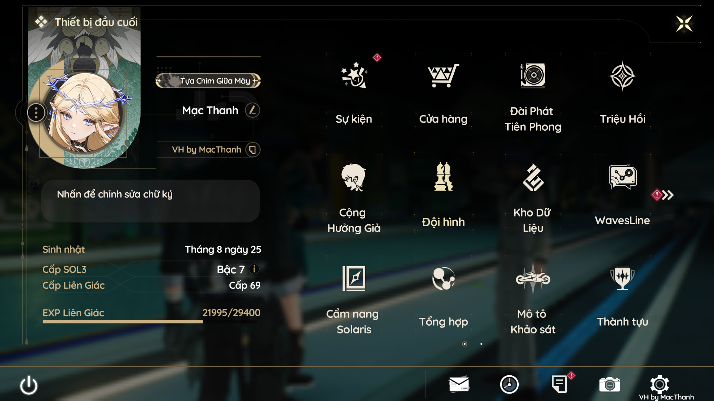
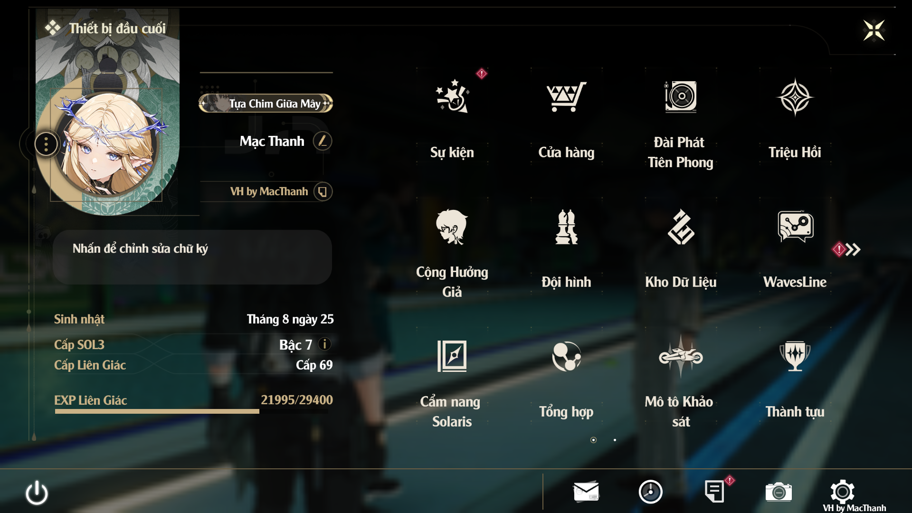

# 🎨 Font Việt Hóa cho Wuthering Waves

Các font thay thế cho bản Việt Hóa Wuthering Waves. Mỗi file `.pak` tương ứng với một font — chỉ cần chọn **một** file và đặt vào thư mục mod để thay đổi font trong game.

## Hướng dẫn cài đặt

1. Chọn font yêu thích từ danh sách bên dưới.
2. Sao chép file `.pak` tương ứng vào thư mục `Fonts/Fonts/Client/` (hoặc theo hướng dẫn cài đặt mod).
3. Khởi động lại game để áp dụng.

> **Lưu ý:** Chỉ sử dụng **một** file font `.pak` tại một thời điểm.

---

## Danh sách Font

### Philosopher

- **File:** `Philosopher_100_P.pak`
- **Phong cách:** Serif cổ điển, thanh lịch
- **Mô tả:** Font chữ có chân (serif) mang phong cách hàn lâm, trang nhã. Các nét chữ có độ tương phản vừa phải giữa nét mảnh và nét đậm, tạo cảm giác đẳng cấp và truyền thống. Phù hợp cho người thích phong cách cổ điển, nghiêm túc.

---

### Quicksand

- **File:** `Quicksand_100_P.pak`
- **Phong cách:** Sans-serif bo tròn, hiện đại
- **Mô tả:** Font không chân (sans-serif) với các đầu nét bo tròn mềm mại, mang hơi hướng hình học. Chữ thanh mảnh, thoáng đãng, dễ đọc trên mọi kích thước. Tạo cảm giác hiện đại, trẻ trung và thân thiện — rất phù hợp với giao diện game.

---

### Signika Bold

- **File:** `Signika-Bold_100_P.pak`
- **Phong cách:** Sans-serif đậm, rõ ràng
- **Mô tả:** Font không chân (sans-serif) với nét dày, đậm và sắc nét. Được thiết kế chuyên cho biển báo và giao diện, đảm bảo độ dễ đọc cao ngay cả ở kích thước nhỏ. Chữ hiển thị đậm, nổi bật — lý tưởng cho ai thích text in đậm, dứt khoát và dễ nhìn.

---

### SRN CookieRun Regular

- **File:** `SRNCookieRun-Regular_100_P.pak`
- **Phong cách:** Tròn, vui nhộn, năng động
- **Mô tả:** Font lấy cảm hứng từ game CookieRun, mang phong cách dễ thương và tràn đầy năng lượng. Các nét chữ bo tròn, hơi phồng, tạo cảm giác vui tươi và ngộ nghĩnh. Thích hợp cho người chơi muốn giao diện game trở nên đáng yêu, nhẹ nhàng hơn.

---

### UTM Alexander

- **File:** `UTMAlexander_100_P.pak`
- **Phong cách:** Serif trang trí, cầu kỳ
- **Mô tả:** Font chữ Việt có chân (serif) với nét vẽ mang tính trang trí cao. Các ký tự có độ cong uốn lượn tinh tế, phảng phất nét thư pháp phương Tây. Tạo cảm giác sang trọng, cổ kính — phù hợp cho ai yêu thích phong cách hoa mỹ, nghệ thuật.

---

### Vòng Xuyến

- **File:** `VongXuyen_100_P.pak`
- **Phong cách:** Thư pháp Việt, bay bổng
- **Mô tả:** Font chữ viết tay mang đậm nét thư pháp Việt Nam. Các nét thanh nét đậm uyển chuyển, nối liền tự nhiên như chữ viết tay thực sự. Ký tự hơi nghiêng, mềm mại, tạo cảm giác bay bổng và lãng mạn. Độc đáo và đậm bản sắc Việt — lựa chọn hoàn hảo cho ai muốn trải nghiệm game với phong cách chữ truyền thống.

---

## So sánh nhanh

| Font | Kiểu chữ | Độ đậm | Cảm giác |
|------|-----------|--------|----------|
| Philosopher | Serif | Trung bình | Cổ điển, hàn lâm |
| Quicksand | Sans-serif tròn | Nhẹ | Hiện đại, trẻ trung |
| Signika Bold | Sans-serif | Đậm | Rõ ràng, dứt khoát |
| SRN CookieRun | Tròn | Trung bình | Vui nhộn, dễ thương |
| UTM Alexander | Serif trang trí | Trung bình | Sang trọng, cầu kỳ |
| Vòng Xuyến | Thư pháp | Biến đổi | Bay bổng, lãng mạn |

---

*Tất cả font đều hỗ trợ đầy đủ tiếng Việt có dấu.*
